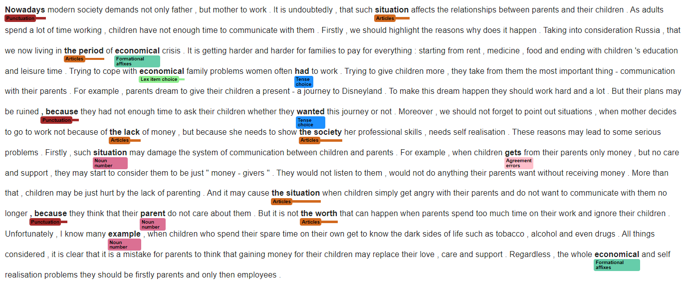

<!-- SPACY PROJECT: AUTO-GENERATED DOCS START (do not remove) -->

# :black_nib: Essay Grammar Checker

Essay Grammar Checker trained on Russian Error-Annotated Learner English Corpus using SpaCy.

## Training 
The checker consists of 6 pipelines each trained on specific error types.
Error Categories used for pipeline mapping:  

```
    "spelling":{"Spelling", "Capitalisation"},  
    "punctuation": {"Punctuation"},
    "articles": {"Articles"},  
    "vocabulary": {"lex_item_choice", "lex_part_choice",
                   'Category_confusion','Formational_affixes'},
    "grammar_major": {'Tense_choice','Prepositions','Agreement_errors', 'Redundant_comp'},
    "grammar_minor": {'Word_order','Noun_number', 'Numerals','Verb_pattern', 'Determiners'}
``` 
The [`project.yml`](grammar_checker/project.yml) defines the data assets required by the
project, as well as the available commands and workflows. For details, see the
[spaCy projects documentation](https://spacy.io/usage/projects).
[`nlp.rehearse`](https://spacy.io/api/pipe/#rehearse) method can be also used to update trained models.


### Commands

The following commands are defined by the project. They
can be executed using [`spacy project run [name]`](https://spacy.io/api/cli#project-run).
Commands are only re-run if their inputs have changed.

| Command | Description |
| --- | --- |
| `preprocess` | Convert the data to spaCy format required |
| `generate_configs` | Configs class weight update |
| `train_pipelines` | Launch training |
| `evaluate_pipelines` | Evaluate models |
| `assemble_pipelines` | Assemble model |
| `package` | Package the resulting model |

### Workflows

The following workflows are defined by the project. They
can be executed using [`spacy project run [name]`](https://spacy.io/api/cli#project-run)
and will run the specified commands in order. Commands are only re-run if their
inputs have changed.

| Workflow | Steps |
| --- | --- |
| `all` | `preprocess` &rarr; `generate_configs` &rarr; `train_pipelines` &rarr; `evaluate_pipelines` &rarr; `assemble_pipelines` &rarr; `package` |

### Assets

The following assets are defined by the project. They can
be fetched by running [`spacy project assets`](https://spacy.io/api/cli#project-assets)
in the project directory.
The data used for training can be extracted from the corpus using the following [code](https://github.com/upunaprosk/corpora-manipulation).

| File | Source | 
| --- | --- | 
| `assets/realec/data_realec.tar.bz2` | [REALEC](https://realec.org) |

# Performance


| Metric | Scores | 
| --- | --- | 
| **f1-scores** | `punctuation`:0.779, `spelling`:0.939, `capitalisation`:0.902, `articles`:0.852, `lex_part_choice`: 0.235, `lex_item_choice`: 0.685, `Category_confusion`: 0.705, `Formational_affixes`: 0.742, `Verb_pattern`:0.629, `Noun_number`:0.920, `Word_order`:0.527, `Numerals`:0.736, `Determiners`:0.044, `Agreement_errors`:0.835, `Prepositions`:0.710, `Redundant_comp`:0.495, `Tense_choice`:0.825 |

# Usage
## Install

```
!pip install https://huggingface.co/iproskurina/en_grammar_checker/resolve/main/en_grammar_checker-any-py3-none-any.whl
```
```
# Using spacy.load().
import spacy
nlp = spacy.load("en_grammar_checker")

# Importing as module.
import en_grammar_checker
nlp = en_grammar_checker.load()
```

## Streamlit
`
streamlit run streamlit_app.py
`

### SpanCategorizer-based rendering



<!-- SPACY PROJECT: AUTO-GENERATED DOCS END (do not remove) -->
